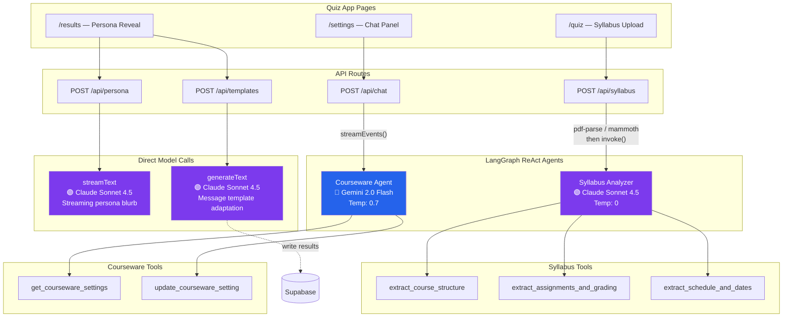

# Teaching Persona Quiz

A web application that helps college instructors discover their teaching persona through a BuzzFeed-style quiz, then guides them through personalized courseware settings. Includes an admin panel for managing questions, viewing results, editing personas, and gating access with codes.

## How It Works

The quiz app has three pages that form a sequential flow:

1. **Quiz** (`/quiz`) — A multi-step quiz with one question per screen. Persona questions determine the teaching persona. Constraint questions ask about course logistics. An optional syllabus upload step sends the document to a dedicated AI agent for structured extraction.

2. **Persona Reveal** (`/results`) — Shows the instructor's teaching persona (Explorer, Nurturer, Mentor, Mastery Coach, or Strategist) with a persona card, an AI-generated personalized blurb streamed from Claude, and a character matched to a real historical figure. Message templates are generated in the background, adapted to the character's voice profile.

3. **Settings** (`/settings`) — Courseware setting cards with dropdowns to change values, plus a chat panel where an AI assistant (in-character as the persona) explains settings and helps describe changes. Recommended values are computed dynamically from the combination of persona, course constraints, and syllabus data.

## AI Architecture

Four API endpoints use two LLM providers (Anthropic Claude + Google Gemini) across two LangGraph ReAct agents and two direct model calls.



### Model Summary

| Model | Provider | Usage | Type | Tools | Streaming |
|-------|----------|-------|------|-------|-----------|
| `claude-sonnet-4-5-20250929` | Anthropic | Syllabus analysis | LangGraph ReAct agent | 3 | No |
| `claude-sonnet-4-5-20250929` | Anthropic | Persona blurb | Direct `streamText` | — | Yes |
| `claude-sonnet-4-5-20250929` | Anthropic | Message templates | Direct `generateText` | — | No |
| `gemini-2.0-flash` | Google | Settings chat | LangGraph ReAct agent | 2 | Yes |

### Agent Details

**Syllabus Analyzer** — Extracts structured data from uploaded syllabi (PDF/DOCX). Calls all three extraction tools systematically, then compiles results into a `SyllabusData` JSON object (course duration, assignment types, grading policies, key dates, module count).

**Courseware Agent** — In-character settings assistant. Stays in the user's matched teaching persona and discusses courseware settings, explaining rationale and answering questions. Can look up current settings and apply changes via tool calls.

Both agents use `createReactAgent` from `@langchain/langgraph` and are initialized as **lazy singletons** — created once on first use, then cached for the server lifetime.

## Tech Stack

- **Framework**: Next.js 16 (App Router, Turbopack)
- **AI**: Vercel AI SDK v6, LangGraph.js
- **LLM Providers**: Anthropic Claude (syllabus, persona, templates), Google Gemini (settings chat)
- **Database**: Supabase (Postgres + Auth + RLS)
- **UI**: Tailwind CSS v4, shadcn/ui
- **State**: React Context + localStorage (quiz state persists across pages)
- **File Parsing**: pdf-parse (PDF), mammoth (DOCX)
- **Validation**: Zod v4

## Getting Started

```bash
# Install dependencies
pnpm install

# Add API keys to each app
# Quiz:  apps/quiz/.env.local
# Admin: apps/admin/.env.local

# Run both apps
pnpm dev
```

- Quiz app: [http://localhost:3000](http://localhost:3000)
- Admin panel: [http://localhost:3001](http://localhost:3001)

### Environment Variables

**Quiz App** (`apps/quiz/.env.local`):

| Variable | Used For |
|---|---|
| `ANTHROPIC_API_KEY` | Persona blurb + syllabus agent + template generation |
| `GOOGLE_GENERATIVE_AI_API_KEY` | Settings chat assistant |
| `NEXT_PUBLIC_SUPABASE_URL` | Supabase project URL (optional) |
| `NEXT_PUBLIC_SUPABASE_ANON_KEY` | Supabase anon key (optional) |

**Admin App** (`apps/admin/.env.local`):

| Variable | Used For |
|---|---|
| `NEXT_PUBLIC_SUPABASE_URL` | Supabase project URL |
| `NEXT_PUBLIC_SUPABASE_ANON_KEY` | Supabase anon key |
| `SUPABASE_SERVICE_ROLE_KEY` | Server-side admin writes (bypasses RLS) |

## Project Structure

```
capstone/
├── apps/
│   ├── quiz/                       # Main quiz app (port 3000)
│   │   ├── app/
│   │   │   ├── page.tsx            Landing page + access code gate
│   │   │   ├── quiz/page.tsx       Multi-step quiz
│   │   │   ├── results/page.tsx    Persona reveal + AI blurb
│   │   │   ├── settings/page.tsx   Setting cards + chat panel
│   │   │   └── api/
│   │   │       ├── persona/        Claude streamText (persona blurb)
│   │   │       ├── chat/           LangGraph courseware agent (Gemini)
│   │   │       ├── syllabus/       LangGraph syllabus agent (Claude)
│   │   │       └── templates/      Claude generateText (message templates)
│   │   ├── components/             UI components + shadcn/ui
│   │   └── lib/
│   │       ├── agents/             LangGraph agent definitions + tools
│   │       ├── data/               Static fallback data
│   │       ├── quiz-context.tsx    React Context + localStorage
│   │       ├── quiz-scoring.ts     Deterministic persona scoring
│   │       └── supabase-queries.ts DB queries with static fallback
│   │
│   └── admin/                      # Admin panel (port 3001)
│       ├── app/
│       │   ├── login/              Email/password auth
│       │   ├── questions/          CRUD + reorder quiz questions
│       │   ├── results/            Quiz results dashboard
│       │   ├── personas/           Edit personas + characters
│       │   └── access-codes/       Generate/revoke access codes
│       └── lib/
│           ├── actions.ts          Server actions (service role)
│           └── supabase-server.ts  Supabase SSR + service client
│
├── packages/
│   └── shared/                     # @capstone/shared
│       └── src/
│           ├── types.ts            Zod schemas + TypeScript types
│           └── supabase.ts         Shared Supabase client singleton
│
└── supabase/
    └── migrations/                 Database schema + seeds
```

## Deployment

Both apps are configured for Vercel deployment. Push to GitHub, connect the repo in Vercel, and add environment variables in the Vercel project settings.
