# Teaching Persona Quiz

A web application that helps college instructors discover their teaching persona through a BuzzFeed-style quiz, then guides them through personalized courseware settings. Includes an admin panel for managing quizzes, personas, characters, and access codes, with AI-powered question generation.

## How It Works

The quiz app has three pages that form a sequential flow:

1. **Quiz** (`/quiz`) — A multi-step quiz with one question per screen. Persona questions determine the teaching persona. Constraint questions ask about course logistics. An optional syllabus upload step sends the document to a dedicated AI agent for structured extraction.

2. **Persona Reveal** (`/results`) — Shows the instructor's teaching persona (Explorer, Nurturer, Mentor, Mastery Coach, or Strategist) with a persona card, an AI-generated personalized blurb streamed from Claude, and a character matched to a real historical figure. Message templates are generated in the background, adapted to the character's voice profile.

3. **Settings** (`/settings`) — Courseware setting cards with dropdowns to change values, plus a chat panel where an AI assistant (in-character as the persona) explains settings and helps describe changes. Recommended values are computed dynamically from the combination of persona, course constraints, and syllabus data.

The admin panel manages all content across the system:

- **Quizzes** — Create quizzes with custom settings schemas (JSONB), then generate or manually add questions per quiz
- **Questions** — CRUD and reorder global quiz questions with persona/constraint types
- **Personas** — Edit the 5 teaching personas, their settings, and assigned characters
- **Characters** — Manage teacher characters with voice profiles, sex/ethnicity demographics, and an AI wizard that suggests new characters per persona and generates full profiles
- **Access Codes** — Generate and revoke codes that gate quiz entry

## AI Architecture

Six API endpoints use two LLM providers (Anthropic Claude + Google Gemini) across three LangGraph ReAct agents and three direct model calls.

```mermaid
flowchart TB
    subgraph clients ["Quiz App Pages"]
        quiz["/quiz — Syllabus Upload"]
        results["/results — Persona Reveal"]
        settings["/settings — Chat Panel"]
    end

    subgraph adminUI ["Admin App"]
        quizMgmt["/onboarding/quizzes/[id]/questions"]
        charMgmt["/onboarding/characters"]
    end

    subgraph quizAPI ["Quiz API Routes"]
        syllabus["POST /api/syllabus"]
        persona["POST /api/persona"]
        templates["POST /api/templates"]
        chat["POST /api/chat"]
    end

    subgraph adminAPI ["Admin API Routes"]
        genQ["POST /api/generate-questions"]
        genChar["POST /api/generate-character"]
    end

    subgraph agents ["LangGraph ReAct Agents"]
        syllAgent["Syllabus Analyzer\n🟣 Claude Sonnet 4.5\nTemp: 0"]
        cwAgent["Courseware Agent\n🔵 Gemini 2.0 Flash\nTemp: 0.7"]
        charAgent["Character Agent\n🟣 Claude Sonnet 4.5\nTemp: 0.8"]
    end

    subgraph syllTools ["Syllabus Tools"]
        t1["extract_course_structure"]
        t2["extract_assignments_and_grading"]
        t3["extract_schedule_and_dates"]
    end

    subgraph cwTools ["Courseware Tools"]
        t4["get_courseware_settings"]
        t5["update_courseware_setting"]
    end

    subgraph charTools ["Character Tools"]
        t6["generate_character_suggestions"]
        t7["generate_character_profile"]
    end

    subgraph direct ["Direct Model Calls"]
        personaLLM["streamText\n🟣 Claude Sonnet 4.5\nStreaming persona blurb"]
        templateLLM["generateText\n🟣 Claude Sonnet 4.5\nMessage template adaptation"]
        questionLLM["generateText\n🟣 Claude Sonnet 4.5\nQuiz question generation"]
    end

    quiz --> syllabus
    results --> persona
    results --> templates
    settings --> chat
    quizMgmt --> genQ
    charMgmt --> genChar

    syllabus -->|"pdf-parse / mammoth\nthen invoke()"| syllAgent
    persona --> personaLLM
    templates --> templateLLM
    chat -->|"streamEvents()"| cwAgent
    genQ --> questionLLM
    genChar -->|"invoke() × 3 steps"| charAgent

    syllAgent --> t1
    syllAgent --> t2
    syllAgent --> t3

    cwAgent --> t4
    cwAgent --> t5

    charAgent --> t6
    charAgent --> t7

    templateLLM -.->|"write results"| supabase[(Supabase)]
    questionLLM -.->|"insert drafts"| supabase

    style syllAgent fill:#7c3aed,color:#fff
    style personaLLM fill:#7c3aed,color:#fff
    style templateLLM fill:#7c3aed,color:#fff
    style questionLLM fill:#7c3aed,color:#fff
    style charAgent fill:#7c3aed,color:#fff
    style cwAgent fill:#2563eb,color:#fff
```



### Model Summary

| Model | App | Usage | Type | Tools | Streaming |
|-------|-----|-------|------|-------|-----------|
| `claude-sonnet-4-5-20250929` | Quiz | Syllabus analysis | LangGraph ReAct agent | 3 | No |
| `claude-sonnet-4-5-20250929` | Quiz | Persona blurb | Direct `streamText` | — | Yes |
| `claude-sonnet-4-5-20250929` | Quiz | Message templates | Direct `generateText` | — | No |
| `gemini-2.0-flash` | Quiz | Settings chat | LangGraph ReAct agent | 2 | Yes |
| `claude-sonnet-4-5-20250929` | Admin | Question generation | Direct `generateText` | — | No |
| `claude-sonnet-4-5-20250929` | Admin | Character suggestions + profiles | LangGraph ReAct agent | 2 | No |

### Agent Details

**Syllabus Analyzer** — Extracts structured data from uploaded syllabi (PDF/DOCX). Calls all three extraction tools systematically, then compiles results into a `SyllabusData` JSON object (course duration, assignment types, grading policies, key dates, module count).

**Courseware Agent** — In-character settings assistant. Stays in the user's matched teaching persona and discusses courseware settings, explaining rationale and answering questions. Can look up current settings and apply changes via tool calls.

**Character Suggestion Agent** — AI wizard for creating new teacher characters in the admin panel. Operates in three steps: (1) generates 5-8 diverse character suggestions for a selected persona, avoiding existing names and ensuring franchise/demographic diversity; (2) provides brief detail previews on demand; (3) generates a full profile including tagline, description, voice profile, sex, and ethnicity, ensuring the voice feels distinct from existing characters in that persona.

All three agents use `createReactAgent` from `@langchain/langgraph` and are initialized as **lazy singletons** — created once on first use, then cached for the server lifetime.

### Direct Model Calls

**Persona Blurb** (Quiz) — Streams a personalized 2-3 paragraph blurb from Claude based on the instructor's persona, constraint answers, and syllabus data.

**Message Templates** (Quiz) — Generates 3 variants per enabled message type using the matched character's voice profile. Writes results to Supabase asynchronously.

**Question Generation** (Admin) — Takes a quiz's settings schema and generates 4-6 scenario-based questions as drafts for admin review and approval. Uses the quiz name, description, and full settings context to produce relevant questions.

## Tech Stack

- **Framework**: Next.js 16 (App Router, Turbopack)
- **AI**: Vercel AI SDK v6 (`streamText`, `generateText`), LangGraph.js (`createReactAgent`)
- **LLM Providers**: Anthropic Claude (syllabus, persona, templates, question generation, character wizard), Google Gemini (settings chat)
- **Database**: Supabase (Postgres + Auth + RLS)
- **UI**: Tailwind CSS v4, shadcn/ui
- **State**: React Context + localStorage (quiz state persists across pages)
- **File Parsing**: pdf-parse (PDF), mammoth (DOCX)
- **Validation**: Zod v4
- **Monorepo**: pnpm workspaces

## Getting Started

```bash
# Install dependencies
pnpm install

# Add API keys to each app
# Quiz:  apps/quiz/.env.local
# Admin: apps/admin/.env.local

# Run both apps
pnpm dev
```

- Quiz app: [http://localhost:3000](http://localhost:3000)
- Admin panel: [http://localhost:3001](http://localhost:3001)

### Environment Variables

**Quiz App** (`apps/quiz/.env.local`):

| Variable | Used For |
|---|---|
| `ANTHROPIC_API_KEY` | Persona blurb + syllabus agent + template generation |
| `GOOGLE_GENERATIVE_AI_API_KEY` | Settings chat assistant |
| `NEXT_PUBLIC_SUPABASE_URL` | Supabase project URL (optional) |
| `NEXT_PUBLIC_SUPABASE_ANON_KEY` | Supabase anon key (optional) |

**Admin App** (`apps/admin/.env.local`):

| Variable | Used For |
|---|---|
| `ANTHROPIC_API_KEY` | AI question generation + character suggestion agent |
| `NEXT_PUBLIC_SUPABASE_URL` | Supabase project URL |
| `NEXT_PUBLIC_SUPABASE_ANON_KEY` | Supabase anon key |
| `SUPABASE_SERVICE_ROLE_KEY` | Server-side admin writes (bypasses RLS) |

## Project Structure

```
capstone/
├── apps/
│   ├── quiz/                       # Main quiz app (port 3000)
│   │   ├── app/
│   │   │   ├── page.tsx            Landing page + access code gate
│   │   │   ├── quiz/page.tsx       Multi-step quiz
│   │   │   ├── results/page.tsx    Persona reveal + AI blurb
│   │   │   ├── settings/page.tsx   Setting cards + chat panel
│   │   │   └── api/
│   │   │       ├── persona/        Claude streamText (persona blurb)
│   │   │       ├── chat/           LangGraph courseware agent (Gemini)
│   │   │       ├── syllabus/       LangGraph syllabus agent (Claude)
│   │   │       └── templates/      Claude generateText (message templates)
│   │   ├── components/             UI components + shadcn/ui
│   │   └── lib/
│   │       ├── agents/             LangGraph agent definitions + tools
│   │       ├── data/               Static fallback data
│   │       ├── quiz-context.tsx    React Context + localStorage
│   │       ├── quiz-scoring.ts     Deterministic persona scoring
│   │       └── supabase-queries.ts DB queries with static fallback
│   │
│   └── admin/                      # Admin panel (port 3001)
│       ├── app/
│       │   ├── login/              Email/password auth
│       │   ├── api/
│       │   │   ├── generate-questions/  Claude generateText (quiz questions)
│       │   │   └── generate-character/  LangGraph character agent (3-step)
│       │   └── onboarding/
│       │       ├── quizzes/        CRUD quizzes + settings schemas
│       │       ├── questions/      CRUD + reorder global questions
│       │       ├── personas/       Edit personas + character assignments
│       │       ├── characters/     AI wizard + manage characters
│       │       └── access-codes/   Generate/revoke access codes
│       ├── components/
│       │   ├── admin-shell.tsx     Layout: black header + sidebar nav
│       │   └── ui/                 shadcn/ui primitives
│       └── lib/
│           ├── agents/             LangGraph character agent + tools
│           ├── actions.ts          Server actions (service role)
│           └── supabase-server.ts  Supabase SSR + service client
│
├── packages/
│   └── shared/                     # @capstone/shared
│       └── src/
│           ├── types.ts            Zod schemas + TypeScript types
│           └── supabase.ts         Shared Supabase client singleton
│
└── supabase/
    └── migrations/                 Database schema + seeds (6 migrations)
```

## Deployment

Both apps are configured for Vercel deployment. Push to GitHub, connect the repo in Vercel, and add environment variables in the Vercel project settings.
