# Teaching Persona Quiz

A web application that helps college instructors discover their teaching persona through a BuzzFeed-style quiz, then guides them through personalized courseware settings. Includes an admin panel for managing quizzes, personas, characters, and access codes, with AI-powered question generation.

## How It Works

The quiz app has three pages that form a sequential flow:

1. **Quiz** (`/quiz`) — A multi-step quiz with one question per screen. Persona questions determine the teaching persona. Constraint questions ask about course logistics. An optional syllabus upload step sends the document to a dedicated AI agent for structured extraction.

2. **Persona Reveal** (`/results`) — Shows the instructor's teaching persona (Explorer, Nurturer, Mentor, Mastery Coach, or Strategist) with a persona card, an AI-generated personalized blurb streamed from Claude, and a character matched to a real historical figure. Message templates begin generating in parallel as soon as a character is selected — before the user clicks "Continue" — so they're ready when the settings page loads.

3. **Settings** (`/settings`) — Courseware setting cards with dropdowns to change values, plus a chat panel where an AI assistant (in-character as the persona) explains settings and helps describe changes. The chat agent receives the instructor's syllabus data and constraint answers as context, so it can reference their specific course structure when explaining why settings are appropriate. Recommended values are computed dynamically from the combination of persona, course constraints, and syllabus data.

The admin panel manages all content across the system:

- **Quizzes** — Create quizzes with custom settings schemas (JSONB), then generate or manually add questions per quiz. Each quiz edit page includes an inline AI chat agent that can read and write across all admin sections (personas, characters, questions, access codes) without navigating away
- **Questions** — CRUD and reorder global quiz questions with persona/constraint types
- **Personas** — Edit the 5 teaching personas, their settings, and assigned characters
- **Characters** — Manage teacher characters with voice profiles, sex/ethnicity demographics, image search with auto-crop to Supabase Storage, and an AI wizard that uses a supervised multi-turn agent to suggest characters, generate full profiles, and search for representative images in a single coordinated flow
- **Access Codes** — Generate and revoke codes that gate quiz entry

## AI Architecture

Ten API endpoints use two LLM providers (Anthropic Claude + Google Gemini) across five LangGraph ReAct agents, three direct model calls, and a two-step image pipeline. Four multi-agent coordination patterns connect otherwise-isolated components: context enrichment (syllabus + constraint data flows into the chat agent), a supervised multi-turn agent (character wizard combines profile generation with image search), parallel fan-out (template generation starts alongside the persona reveal), and a cross-section admin assistant (chat agent with 14 tools for reading and writing across all admin entities).

```mermaid
flowchart TB
    subgraph clients ["Quiz App Pages"]
        quiz["/quiz — Syllabus Upload"]
        results["/results — Persona Reveal"]
        settings["/settings — Chat Panel"]
    end

    subgraph adminUI ["Admin App"]
        quizEdit["/onboarding/quizzes/[id] — Chat Panel"]
        quizMgmt["/onboarding/quizzes/[id]/questions"]
        charWizard["/onboarding/characters/new"]
        charMgmt["/onboarding/characters"]
    end

    subgraph quizAPI ["Quiz API Routes"]
        syllabus["POST /api/syllabus"]
        persona["POST /api/persona"]
        templates["POST /api/templates"]
        chat["POST /api/chat"]
    end

    subgraph adminAPI ["Admin API Routes"]
        adminChat["POST /api/chat"]
        genQ["POST /api/generate-questions"]
        genChar["POST /api/generate-character"]
        genCharFull["POST /api/generate-character-full"]
        findImg["POST /api/find-image"]
        cropImg["POST /api/crop-image"]
    end

    subgraph agents ["LangGraph ReAct Agents"]
        syllAgent["Syllabus Analyzer\n🟣 Claude Sonnet 4.5\nTemp: 0"]
        cwAgent["Courseware Agent\n🔵 Gemini 2.0 Flash\nTemp: 0.7"]
        charAgent["Character Agent\n🟣 Claude Sonnet 4.5\nTemp: 0.8\n2 tools"]
        charWizardAgent["Character Wizard Agent\n🟣 Claude Sonnet 4.5\nTemp: 0.8\n4 tools"]
        adminAgent["Admin Chat Agent\n🟣 Claude Sonnet 4.5\nTemp: 0.7\n14 tools"]
    end

    subgraph syllTools ["Syllabus Tools"]
        t1["extract_course_structure"]
        t2["extract_assignments_and_grading"]
        t3["extract_schedule_and_dates"]
    end

    subgraph cwTools ["Courseware Tools"]
        t4["get_courseware_settings"]
        t5["update_courseware_setting"]
    end

    subgraph charTools ["Character Tools"]
        t6["generate_character_suggestions"]
        t7["generate_character_profile"]
    end

    subgraph imgTools ["Image Tools"]
        t8["find_character_image"]
        t9["save_character_image"]
    end

    subgraph adminTools ["Admin Tools (14)"]
        at1["list/get/update quizzes"]
        at2["list/get/create/update questions"]
        at3["list/update personas"]
        at4["list/create/update characters"]
        at5["list/create access codes"]
    end

    subgraph direct ["Direct Model Calls"]
        personaLLM["streamText\n🟣 Claude Sonnet 4.5\nStreaming persona blurb"]
        templateLLM["generateText\n🟣 Claude Sonnet 4.5\nMessage template adaptation"]
        questionLLM["generateText\n🟣 Claude Sonnet 4.5\nQuiz question generation"]
    end

    subgraph imgPipeline ["Image Pipeline"]
        serper["🟢 Serper.dev\nGoogle Images API"]
        sharp["sharp\ncenter-crop 512×512 WebP"]
    end

    quiz --> syllabus
    results --> persona
    results -->|"pre-fires on\ncharacter select"| templates
    settings --> chat
    quizEdit -->|"streamEvents()\n+ quiz context"| adminChat
    quizMgmt --> genQ
    charWizard -->|"supervised\nmulti-step"| genCharFull
    charMgmt --> genChar
    charMgmt --> findImg
    charMgmt --> cropImg

    syllabus -->|"pdf-parse / mammoth\nthen invoke()"| syllAgent
    persona --> personaLLM
    templates --> templateLLM
    chat -->|"streamEvents()\n+ syllabus & constraints"| cwAgent
    genQ --> questionLLM
    adminChat -->|"streamEvents()\n+ quiz context"| adminAgent
    genChar -->|"invoke() × 3 steps"| charAgent
    genCharFull -->|"invoke() per step\nsuggestions → profile+images → save"| charWizardAgent

    findImg -->|"query: name + work"| serper
    cropImg -->|"download → crop"| sharp
    sharp -->|"upload WebP"| storage[("Supabase Storage\nCharacters bucket")]

    syllAgent --> t1
    syllAgent --> t2
    syllAgent --> t3

    cwAgent --> t4
    cwAgent --> t5

    charAgent --> t6
    charAgent --> t7

    charWizardAgent --> t6
    charWizardAgent --> t7
    charWizardAgent --> t8
    charWizardAgent --> t9

    adminAgent --> at1
    adminAgent --> at2
    adminAgent --> at3
    adminAgent --> at4
    adminAgent --> at5
    at1 -.->|"read/write"| supabase
    at2 -.->|"read/write"| supabase
    at3 -.->|"read/write"| supabase
    at4 -.->|"read/write"| supabase
    at5 -.->|"read/write"| supabase

    t8 -->|"query: name + work"| serper
    t9 -->|"download → crop → upload"| sharp
    sharp -->|"upload WebP"| storage

    templateLLM -.->|"write results"| supabase[(Supabase DB)]
    questionLLM -.->|"insert drafts"| supabase

    style syllAgent fill:#7c3aed,color:#fff
    style personaLLM fill:#7c3aed,color:#fff
    style templateLLM fill:#7c3aed,color:#fff
    style questionLLM fill:#7c3aed,color:#fff
    style charAgent fill:#7c3aed,color:#fff
    style charWizardAgent fill:#7c3aed,color:#fff
    style adminAgent fill:#7c3aed,color:#fff
    style cwAgent fill:#2563eb,color:#fff
    style serper fill:#16a34a,color:#fff
    style sharp fill:#16a34a,color:#fff
    style storage fill:#0891b2,color:#fff
```



### Model Summary

| Model | App | Usage | Type | Tools | Streaming |
|-------|-----|-------|------|-------|-----------|
| `claude-sonnet-4-5-20250929` | Quiz | Syllabus analysis | LangGraph ReAct agent | 3 | No |
| `claude-sonnet-4-5-20250929` | Quiz | Persona blurb | Direct `streamText` | — | Yes |
| `claude-sonnet-4-5-20250929` | Quiz | Message templates | Direct `generateText` | — | No |
| `gemini-2.0-flash` | Quiz | Settings chat (with syllabus + constraint context) | LangGraph ReAct agent | 2 | Yes |
| `claude-sonnet-4-5-20250929` | Admin | Question generation | Direct `generateText` | — | No |
| `claude-sonnet-4-5-20250929` | Admin | Character suggestions + profiles (fallback) | LangGraph ReAct agent | 2 | No |
| `claude-sonnet-4-5-20250929` | Admin | Character wizard (multi-turn supervisor) | LangGraph ReAct agent | 4 | No |
| `claude-sonnet-4-5-20250929` | Admin | Admin chat agent (cross-section assistant) | LangGraph ReAct agent | 14 | Yes |

### Agent Details

**Syllabus Analyzer** — Extracts structured data from uploaded syllabi (PDF/DOCX). Calls all three extraction tools systematically, then compiles results into a `SyllabusData` JSON object (course duration, assignment types, grading policies, key dates, module count).

**Courseware Agent** — In-character settings assistant. Stays in the user's matched teaching persona and discusses courseware settings, explaining rationale and answering questions. Can look up current settings and apply changes via tool calls. Receives syllabus-extracted course structure and constraint answers as injected context, so it can reference the instructor's specific course characteristics (duration, assignment types, grading policies, class constraints) when explaining why settings are appropriate.

**Character Suggestion Agent** — Fallback agent for the step-based character creation flow in the admin panel. Operates in three stateless steps: (1) generates 5-8 diverse character suggestions for a selected persona; (2) provides brief detail previews on demand; (3) generates a full profile including tagline, description, voice profile, sex, and ethnicity. Uses 2 tools (`generate_character_suggestions`, `generate_character_profile`).

**Character Wizard Agent** — Supervised multi-turn agent for the new-character wizard. Extends the Character Suggestion Agent with 2 additional image tools (`find_character_image`, `save_character_image`) for a total of 4 tools. The wizard endpoint (`/api/generate-character-full`) invokes this agent per step: (1) `"suggestions"` — generates character suggestions; (2) `"profile"` — generates a full profile AND searches for representative images in a single invocation, returning both together; (3) `"save-image"` — downloads, center-crops to 512×512 WebP, and uploads the selected image to Supabase Storage. The wizard UI falls back to the step-based agent if the full endpoint fails.

**Admin Chat Agent** — Cross-section admin assistant embedded inline on the quiz edit page. Has 14 tools for reading and writing across all admin entities: quizzes (list/get/update), questions (list/get/create/update), personas (list/update), characters (list/create/update), and access codes (list/create). Receives the current quiz's ID and name as context so it can resolve "this quiz" references. Confirms before write operations. No delete tools for safety.

All five agents use `createReactAgent` from `@langchain/langgraph` and are initialized as **lazy singletons** — created once on first use, then cached for the server lifetime.

### Direct Model Calls

**Persona Blurb** (Quiz) — Streams a personalized 2-3 paragraph blurb from Claude based on the instructor's persona, constraint answers, and syllabus data.

**Message Templates** (Quiz) — Generates 3 variants per enabled message type using the matched character's voice profile. Pre-fires as a parallel fan-out on the results page as soon as a character is selected — before the user clicks "Continue to Settings" — so templates are ready when the settings page loads. Writes results to Supabase after the quiz result record is persisted.

**Question Generation** (Admin) — Takes a quiz's settings schema and generates 4-6 scenario-based questions as drafts for admin review and approval. Uses the quiz name, description, and full settings context to produce relevant questions.

### Image Pipeline

**Character Image Search** (Admin) — Two paths for finding and storing character images:

1. **Agent-integrated** (wizard flow) — The Character Wizard Agent calls `find_character_image` during profile generation to search Serper.dev and return 6 image candidates alongside the profile. When the user selects an image, the agent calls `save_character_image` to download, crop, and upload in a single coordinated step. This is the primary path for the new-character wizard.

2. **Standalone** (edit flow) — The `/api/find-image` route searches Serper.dev using a `"name work character"` query template and returns 8 thumbnail/URL pairs. The `/api/crop-image` route downloads the selected image, center-crops to 1:1 aspect ratio, resizes to 512×512 WebP via sharp, and uploads to the Supabase Storage `Characters` bucket. Used by the `ImageSearch` component in the character edit view.

Both paths produce identical output: a 512×512 WebP image stored in the Supabase Storage `Characters` bucket with the character ID as the filename.

### Multi-Agent Coordination

Four coordination patterns connect otherwise-isolated AI components:

| Pattern | App | What Coordinates | How |
|---------|-----|-----------------|-----|
| Context enrichment | Quiz | Syllabus Agent → Courseware Agent | Syllabus-extracted data and constraint answers are injected into the chat API request body, giving the Courseware Agent awareness of course structure |
| Supervised multi-turn | Admin | Character Wizard Agent | Single agent with 4 tools handles suggestions → profile + image search → image save across multiple supervised invocations via `/api/generate-character-full` |
| Parallel fan-out | Quiz | Results Page → Template Generation | Template generation fires as a `useEffect` when a character is selected, running concurrently with persona blurb streaming so templates are pre-loaded before navigation |
| Cross-section assistant | Admin | Admin Chat Agent on quiz edit page | Single streaming agent with 14 tools reads and writes across all admin entities (quizzes, questions, personas, characters, access codes) via direct Supabase queries, with quiz context injected per conversation |

## Tech Stack

- **Framework**: Next.js 16 (App Router, Turbopack)
- **AI**: Vercel AI SDK v6 (`streamText`, `generateText`), LangGraph.js (`createReactAgent`)
- **LLM Providers**: Anthropic Claude (syllabus, persona, templates, question generation, character wizard), Google Gemini (settings chat)
- **Database**: Supabase (Postgres + Auth + RLS)
- **UI**: Tailwind CSS v4, shadcn/ui
- **State**: React Context + localStorage (quiz state persists across pages)
- **File Parsing**: pdf-parse (PDF), mammoth (DOCX)
- **Image Processing**: sharp (crop + resize), Supabase Storage
- **Image Search**: Serper.dev (Google Images API)
- **Validation**: Zod v4
- **Monorepo**: pnpm workspaces

## Getting Started

```bash
# Install dependencies
pnpm install

# Add API keys to each app
# Quiz:  apps/quiz/.env.local
# Admin: apps/admin/.env.local

# Run both apps
pnpm dev
```

- Quiz app: [http://localhost:3000](http://localhost:3000)
- Admin panel: [http://localhost:3001](http://localhost:3001)

### Environment Variables

**Quiz App** (`apps/quiz/.env.local`):

| Variable | Used For |
|---|---|
| `ANTHROPIC_API_KEY` | Persona blurb + syllabus agent + template generation |
| `GOOGLE_GENERATIVE_AI_API_KEY` | Settings chat assistant |
| `NEXT_PUBLIC_SUPABASE_URL` | Supabase project URL (optional) |
| `NEXT_PUBLIC_SUPABASE_ANON_KEY` | Supabase anon key (optional) |

**Admin App** (`apps/admin/.env.local`):

| Variable | Used For |
|---|---|
| `ANTHROPIC_API_KEY` | AI question generation + character wizard + admin chat agent |
| `NEXT_PUBLIC_SUPABASE_URL` | Supabase project URL |
| `NEXT_PUBLIC_SUPABASE_ANON_KEY` | Supabase anon key |
| `SUPABASE_SERVICE_ROLE_KEY` | Server-side admin writes (bypasses RLS) |
| `SERPER_API_KEY` | Character image search via Serper.dev (optional) |

## Project Structure

```
capstone/
├── apps/
│   ├── quiz/                       # Main quiz app (port 3000)
│   │   ├── app/
│   │   │   ├── page.tsx            Landing page + access code gate
│   │   │   ├── quiz/page.tsx       Multi-step quiz
│   │   │   ├── results/page.tsx    Persona reveal + AI blurb
│   │   │   ├── settings/page.tsx   Setting cards + chat panel
│   │   │   └── api/
│   │   │       ├── persona/        Claude streamText (persona blurb)
│   │   │       ├── chat/           LangGraph courseware agent (Gemini)
│   │   │       ├── syllabus/       LangGraph syllabus agent (Claude)
│   │   │       └── templates/      Claude generateText (message templates)
│   │   ├── components/             UI components + shadcn/ui
│   │   └── lib/
│   │       ├── agents/             LangGraph agent definitions + tools
│   │       ├── data/               Static fallback data
│   │       ├── quiz-context.tsx    React Context + localStorage
│   │       ├── quiz-scoring.ts     Deterministic persona scoring
│   │       └── supabase-queries.ts DB queries with static fallback
│   │
│   └── admin/                      # Admin panel (port 3001)
│       ├── app/
│       │   ├── login/              Email/password auth
│       │   ├── api/
│       │   │   ├── chat/                     LangGraph admin chat agent (14 tools, streaming)
│       │   │   ├── generate-questions/       Claude generateText (quiz questions)
│       │   │   ├── generate-character/       LangGraph character agent (3-step fallback)
│       │   │   ├── generate-character-full/  Supervised multi-turn wizard (4-tool agent)
│       │   │   ├── find-image/               Serper.dev image search (standalone)
│       │   │   └── crop-image/               Download, crop, store (standalone)
│       │   └── onboarding/
│       │       ├── quizzes/        CRUD quizzes + settings schemas
│       │       ├── questions/      CRUD + reorder global questions
│       │       ├── personas/       Edit personas + character assignments
│       │       ├── characters/     AI wizard + manage characters
│       │       └── access-codes/   Generate/revoke access codes
│       ├── components/
│       │   ├── admin-shell.tsx     Layout: black header + sidebar nav
│       │   └── ui/                 shadcn/ui primitives
│       └── lib/
│           ├── agents/
│           │   ├── admin-chat-agent.ts  Admin Chat Agent (14 tools, cross-section)
│           │   ├── character-agent.ts   Character Agent + Character Wizard Agent
│           │   ├── index.ts             Lazy singletons for all three agents
│           │   └── tools/
│           │       ├── admin-tools.ts     14 CRUD tools for all admin entities
│           │       ├── character-tools.ts  suggestions + profile tools
│           │       └── image-tools.ts      find + save image tools
│           ├── actions.ts          Server actions (service role)
│           └── supabase-server.ts  Supabase SSR + service client
│
├── packages/
│   └── shared/                     # @capstone/shared
│       └── src/
│           ├── types.ts            Zod schemas + TypeScript types
│           └── supabase.ts         Shared Supabase client singleton
│
└── supabase/
    └── migrations/                 Database schema, seeds + storage (9 migrations)
```

## Deployment

Both apps are configured for Vercel deployment. Push to GitHub, connect the repo in Vercel, and add environment variables in the Vercel project settings.
